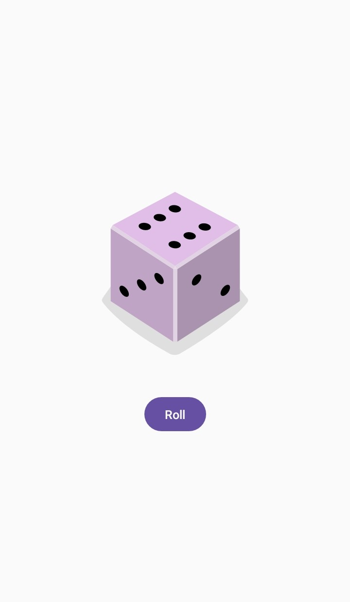

# Dice Roller App

Welcome to the repository for the Dice Roller App, a simple yet effective application designed as part of my [Android Basics with Compose](https://developer.android.com/courses/android-basics-compose/course). This app simulates the action of rolling a dice with the tap of a button, perfect for demonstrating the integration of user interactions and state management in Android development.

## Project Overview

The Dice Roller App offers a minimalist interface that features a single button to 'roll' a dice. Each tap on the button results in a different dice image being displayed, corresponding to one of the six possible outcomes of a traditional dice roll. This project leverages Jetpack Compose to handle UI and state changes efficiently.

## App Screenshot

This is a screenshot of the Dice Roller App. This image captures the app's clean and intuitive user interface, centered around the single button used for rolling the dice. Each tap on the button results in a different dice face appearing, showcasing the app's dynamic state management and responsive design. The simple yet effective UI exemplifies the app's functionality, providing a visual demonstration of how users interact with the application to simulate the rolling of a dice.

## Learning Outcomes

Through the development of this app, I achieved the following key learning outcomes:

- **Advanced Kotlin Fundamentals**: Enhanced my proficiency in Kotlin by applying advanced programming techniques that underpin the app's functionality. This includes managing state and handling user interactions within a Jetpack Compose environment (see [Kotlin Practice](https://github.com/mateuszs6/KotlinPractice.git) for foundational practices).

- **Composition and Recomposition**: Gained a deeper understanding of how Jetpack Compose manages UI components and handles recomposition when the app state changes. This skill is critical for developing responsive apps that update their display based on user actions.

- **Interactive UI Development**: Developed a responsive UI component—a button that changes the displayed dice image on each tap. This practical application of user interaction design is crucial for engaging app experiences.

- **State Management**: Implemented state handling to update the dice image dynamically with each new roll. Efficient state management ensures that the UI updates promptly and accurately in response to user inputs.

## App Features

- **Single Interactive Button**: A central button that users can tap to 'roll' the dice, with each tap randomly changing the dice face displayed.
- **Dynamic Image Updates**: Utilises state management to immediately reflect changes in the dice face after each tap, demonstrating real-time UI updates.

## How to Use This Repository

To explore and run the Dice Roller App:
1. Clone this repository to your local machine.
2. Open the project in Android Studio.
3. Sync the project with Gradle to ensure all dependencies are properly configured.
4. Run the app on an Android emulator or a connected Android device to see it in action.

## Future Enhancements

Planned updates for the Dice Roller App include:
- Enhancing the UI design to include animations that mimic the rolling of a dice.
- Adding functionality to allow users to choose the number of dice they want to roll simultaneously.
- Implementing a feature to save the history of dice rolls for user reference.

Thank you for visiting the Dice Roller App repository! Feedback and contributions to further enhance and expand the app's functionality are greatly appreciated.
